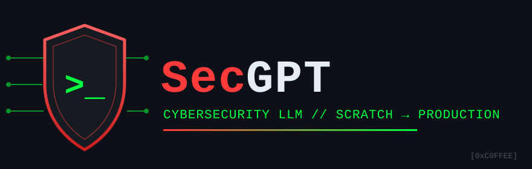

<div align="center">
  

  # SecGPT

  **Building a Cybersecurity LLM from Scratch to Production**

  []()
  []()
  []()
  [](SecGPT-Prod/eval/)
  [](LICENSE)

  A comparative study of three approaches to building a domain-specific security
  language model on consumer hardware (RTX 4060 Laptop, 8 GB VRAM).
</div>

---

## Table of Contents

- [The Question](#the-question)
- [The Three Models](#the-three-models)
- [Key Findings](#key-findings)
- [Repository Structure](#repository-structure)
- [Quick Start (SecGPT-Prod)](#quick-start-secgpt-prod)
- [Data Availability & Reproducing](#data-availability--reproducing)
- [Benchmark](#benchmark)
- [Hardware Requirements](#hardware-requirements)
- [Datasets Used](#datasets-used)
- [What's Next](#whats-next)
- [License](#license)
- [Author](#author)

## The Question

> Can you build a useful cybersecurity assistant locally, and what does the journey from "random weights" to "accurate answers" actually look like?

## The Three Models

| | SecGPTv2 | SecGPTv3 | SecGPT-Prod |
|---|---|---|---|
| **Approach** | Built from scratch | Pretrained GPT-2 + SFT | Pretrained Qwen2.5-3B + QLoRA |
| **Params** | 17.4M | 124M | 1.7B |
| **Training data** | 77.8 MB corpus | 600 Q&A pairs | 31,111 Q&A pairs |
| **Pipeline** | Pretrain → SFT → DPO | Domain-adapt → SFT → DPO | QLoRA SFT → DPO |
| **Result** | Readable fragments | Broken (collapsed) | ✅ Working security assistant |
| **Old 7-prompt demo** | 0/7 | 0/7 | 7/7 |
| **291-prompt benchmark** | not yet run | not yet run | **62.2% SFT** (base 44.7%, +DPO 60.1%) |
| **Train time** | 51 min | 27 min | 2 h SFT + 2.5 h DPO |

## Key Findings

1. **From-scratch training teaches the pipeline, not the product.** SecGPTv2 demonstrates every concept (tokenization, attention, loss, generation) but can't produce useful output at 17M params.

2. **Pretrained base + tiny data = failure.** GPT-2 Small with 600 SFT pairs collapsed into repetition. You need BOTH a capable base AND sufficient domain data.

3. **QLoRA on a strong base + 31K pairs = working product.** Qwen2.5-3B with 4-bit quantization + LoRA adapters writes valid Sigma rules and answers security questions in 5 GB VRAM — but the 291-prompt benchmark exposed the limits the 7-prompt demo hid.

4. **The 3-stage pipeline (Pretrain → SFT → Align) is universal.** Same pattern whether you're training from scratch or fine-tuning a 175B model. Scale changes, concepts don't.

5. **Naive SFT teaches behavior but corrupts facts (control experiment).** Base Qwen hallucinates MITRE IDs 20% of the time; after template-generated SFT (truncated 600-char answers) it hallucinates 87.5% — while genuinely improving at rules (+48 pts), classification (+38), and extraction (+30). Data quality is the bottleneck, not scale or alignment. See [SecGPT-Prod/eval/README.md](SecGPT-Prod/eval/README.md).

6. **DPO is accuracy-neutral.** Style alignment learned cleanly (99.3% reward accuracy) but moved no accuracy metric — hallucination is a knowledge problem, not a preference problem.

## Repository Structure

```
SecGPT/
├── README.md              ← this file
├── LICENSE                ← educational/research use terms
├── DATA.md                ← data availability + reproduction pipelines
├── Docs/
│   ├── PLAN.md            ← master plan: 4-model study, status, sequence
│   └── V3_DATA_SPEC.md    ← next data iteration spec (STIX, StackExchange, open corpus)
├── assets/logo.svg        ← project logo
├── test_prompts.json      ← 80 legacy demo prompts (10 per category)
│                            (v2-style <|tag|> prefixes; superseded by SecGPT-Prod/eval/)
│
├── SecGPTv2/              ← From-scratch model (learning exercise)
│   ├── llm_build.md       ← Full build log covering all 8 pre-training steps
│   ├── requirements.txt
│   ├── src/               ← Training scripts (custom GPT, tokenizer, SFT, DPO)
│   ├── stage1_pre-training/  ← 8-step pipeline (input/output dirs per step)
│   ├── stage2_sft/        ← SFT documentation + results
│   └── stage3_alignment/  ← DPO documentation + results
│
├── SecGPTv3/              ← GPT-2 attempt (documented failure + lessons)
│   ├── doc.md             ← Honest analysis of what went wrong
│   ├── requirements.txt
│   └── src/               ← Pipeline scripts
│
└── SecGPT-Prod/           ← Working model (Qwen2.5-3B + QLoRA)
    ├── doc.md             ← Build documentation (metrics, architecture, locations)
    ├── BENCHMARK.md       ← Legacy 7-prompt 3-model comparison
    ├── USAGE.md           ← How to run and use the model
    ├── eval/              ← 291-prompt benchmark harness + stage history
    ├── requirements.txt
    ├── src/               ← Data builders, QLoRA SFT, DPO, benchmark runner
    ├── stage1_sft/        ← SFT LoRA checkpoints (weights gitignored)
    └── stage2_alignment/  ← DPO checkpoint (weights gitignored)
```

## Quick Start (SecGPT-Prod)

```bash
pip install -r SecGPT-Prod/requirements.txt
cd SecGPT-Prod
python src/quality_check.py   # needs the trained LoRA adapter — see DATA.md
```

See [SecGPT-Prod/USAGE.md](SecGPT-Prod/USAGE.md) for full instructions.

## Data Availability & Reproducing

Model weights and generated datasets are not tracked in git (too large / regenerable / non-redistributable) — a fresh clone contains code, configs, and docs only.

See [DATA.md](DATA.md) for the annotated folder map and full reproduction pipelines.

## Benchmark

The old 7-prompt demo ([BENCHMARK.md](SecGPT-Prod/BENCHMARK.md)) is superseded by a
291-prompt two-layer harness ([SecGPT-Prod/eval/](SecGPT-Prod/eval/)) with objective
scorers, leakage splits, hallucination tracking, and N-way stage comparison.

Current stage history (Qwen2.5-3B line):

| Stage | Overall | Held-out | TTP hallucination |
|---|---|---|---|
| Base (control) | 44.7% | 58.5% | 20.0% |
| SFT (31K pairs) | 62.2% | 79.2% | 87.5% |
| SFT + DPO | 60.1% | 79.2% | 83.3% |

**Prompt sample:** *"Write a Sigma detection rule for suspicious PowerShell encoded command execution."*

| SecGPTv2 (17.4M) | SecGPTv3 (124M) | SecGPT-Prod (1.7B) |
|---|---|---|
| Format correct, content garbled | Repetitive garbage | ✅ Valid detection logic |

## Hardware Requirements

- GPU: NVIDIA with 6+ GB VRAM (tested: RTX 4060 Laptop, 8 GB)
- RAM: 16+ GB
- Disk: ~10 GB (base model + dependencies)
- Python: 3.11+
- OS: Windows/Linux

## Datasets Used

| Source | Records | Content |
|---|---|---|
| DFIR-Nexus (MITRE, Sigma, LOLBAS, GTFOBins, etc.) | 17,950 | Detection rules, TTPs, tool references |
| CADRE KB (SANS, HTB Academy, Malpedia, Mandiant, etc.) | 483,800 chunks | Security courses, IR reports, malware descriptions |
| UCI SMS Spam Collection | 5,574 | Spam/ham classification |
| NSL-KDD | 148,517 | Network intrusion detection |

## What's Next

- [x] Security-specific evaluation framework → `SecGPT-Prod/eval/` (291 prompts, 3-way stage history)
- [x] DPO alignment on SecGPT-Prod → accuracy-neutral, hallucination −4.2 pts
- [ ] **Data-quality iteration (current focus):** SFT v2 pairs built (knowledge-anchored, dedup'd, hard negatives) — awaiting train; v3 spec in [Docs/V3_DATA_SPEC.md](Docs/V3_DATA_SPEC.md) (MITRE STIX, StackExchange, open corpus)
- [ ] SecGPTv3 fairness run: GPT-2 + SFT on 31K pairs + DPO
- [ ] SecGPTv2.5: ~100M from scratch (max effort on 8 GB VRAM) — parked
- [ ] Scale to Qwen2.5-7B for better reasoning
- [ ] Multi-turn conversation support
- [ ] RAG integration (post-cutoff facts only; corpus already baked into weights)

## License

Educational/research use — see [LICENSE](LICENSE). Base models subject to their respective licenses:
- Qwen2.5-3B-Instruct: [Qwen License](https://huggingface.co/Qwen/Qwen2.5-3B-Instruct/blob/main/LICENSE)
- GPT-2: OpenAI Modified MIT License

## Author

Built as part of the HTB AI Red Teamer certification study — learning by building.
